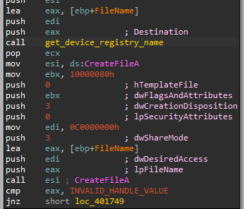
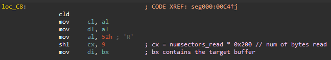

# Reversing the ESPecter bootkit (non-uefi, only mbr part for now)

## The Infector

### The main function

Seems we get an non-packed payload. The main function looks like this:


First, a function is called to decide if  we're a Wow64 process (running on a 64bit system) or not. The patch_disk function is only called if we're on a real 32bit PC. Looks like **this is a 32 bit version of this bootkit**.

### Checking whether we're in 32bit

This is done via the `IsWow64Process` API which is resolved dynamically from a handle to kernel32:


### Obtaining a handle to the disk device

First thing is, a handle is acquired to the disk device.


This is first attempted by parsing some registry values to get the device name and using CreateFileA on that.



The key is `"SYSTEM\CurrentControlSet\services\Disk\Enum\0"` and it's appended the UUID `{53f56307-b6bf-11d0-94f2-00a0c91efb8b}`. This UUID is `GUID_DEVINTERFACE_DISK`. According to MSDN : `The system-supplied storage class drivers register an instance of GUID_DEVINTERFACE_DISK for a hard disk storage device`. Seems like it's maybe trying to get a handle to a storage device driver responsible for that disk. Anyway, it's purpose is clear and not very interesting.

If the handle cannot be obtained using this method, it tries to obtain a handle to `"\\\\.\\PhysicalDrive0"`


### Sanity testing the MBR

After the handle is obtained it does a sanity test on the first sector. It makes sure the first two bytes of it are non-null.

It first reads 0x200 (512 - sector size) from the disk device handle to the stack.


And makes sure the first two bytes are non-null (bl is zeroed here).


Zero as a return value is actually a success indicator here:


Perhaps the function signature is something like `bool is_mbr_broken(HANDLE hDevice)`. (That way a return value of `true` indicates an error).

### Backup beep.sys

The driver `C:\Windows\System32\drivers\beep.sys` is copied to `C:\Windows\Help\intel.chm`.

This maybe a hint to it being infected in the future.


### Writing the encrypted configuration

First, it writes some resource I couldn't figure out to physical 0x800 (5th sector, one-counted).


This resource is obtained from the mapped PE in the process address space:


After further checking online this is actually the encrypted configuration file.

### Writing driver payload

Next, It decrypts the kernel mode driver payload: 


And writes it to physical 0xA00 (6th sector, one-counted)

### Backing up the MBR

It then backs up the MBR.

Before doing that it first checks whether the MBR is already backed up in the second sector.

It reads the first sector (MBR), and the second one (maybe already backed up MBR)


And then passes both of these buffers to the function checking if the backup already exists:


The function looks like this:


To check if the mbr is already backed successfully up it checks the following:

1. The first sector (MBR) does not start with 0x33. This is because the normal windows bootloader will start with 0x33:


2. If the MBR indeed does not start with 0x33 (an indicator that is was already overwritten by the bootkit) it checks that the backup was done successfully by verifying that it ends with 0xaa. (because 0xaa55 is the signature for a bootable driver and an MBR is always terminated with it).
3. The second sector (potential original mbr backup) should start with 0x33 (because it's a backup of the original).
4. The second sector should end with 0xaa (as stated before - bootable sector signature).

If the mbr is not already backed up it reads 0x200 bytes from offset 0x0 (reads the MBR).


(notice the second sector buffer is now reused as the new MBR buffer)

And writes the original MBR to the second sector:


### Overwrite mbr and some other stuff

First, it checks the os version and depending on it loads different resources:


It also decrypts the new MBR in the process.

It then copies parts of the original MBR over the new mbr:


These functions look like so:


They read the original MBR, take it at an offset and copy that offset over the new MBR at certain offsets.

The 3 payloads are then written to the disk:

1. The MBR at physical 0x0 (1st sector, one-counted):

   

2. The second payload at physical 0x400 (3rd sector, one-counted):

   

3. The third payload at physical 0x600 (4th sector, one-counted):

   


The disk looks like this:


## The new MBR

### Debugging the boot process

I wanted to get debugging functionality on the new MBR so I created a 32bit windows  VMware machine.

Then I changed the VMX file:


And in IDA pressed Debugger->Attach->Remote GDB Process and entered localhost::8832 as the address:


Great. Now let's debug this shit.

### Boilerplate and backups

The first things to execute are the following instrucitons:


They clean the stack segment, save the the old sp in 0x7bfe and set sp to point to there (sort of like a push old sp after setting the new sp).


Afterwards the ds segment is cleared, all general purpose registers are pushed and the direction flag is cleard.

### Memory region setup


Now this is a little more complicated.

From looking online we can see that 00:0x413 contains the size of free memory from the bottom of memory until EBDA in units of 2KBs. 


BIOS memory map:


This size is subtracted by 2 (decreased by 2KBs), updated and then placed multiplied by 64 in es. Because EBDA is reserved the es register is placed after the bootsector and some space before the EBDA to allow usage of some free memory.

An interesting anecdote:

INT 12H does exactly (reads a word at 00:0x413) this when returning the memory size in KBs. I wonder why the author didn't use that API and if he knew about it:


This memory indeed looks like it's nulled:


It then copies It's own first 0x200 first bytes (the whole MBR = 0x100 * sizeof(word)) to that free memory blob. (copies from ds:esi to es:edi)


And reads two sectors from after the backed up MBR to immediately after the copied MBR to before the EBDA.


So now the memory layout before the EBDA looks like so:

```
[EBDA - 0x2000] -> Malicious MBR
[EBDA - 0x1800] -> Sector 2 (0-counted)
[EBDA - 0x1600] -> Sector 3
[EBDA - 0x1400] -> NULL padding
[EBDA] -> EBDA (BIOS reserved)
```

These newly loaded bytes are then decrypted:


The decryption works the following way:

```python
for byte in encrypted: # len(encrypted) == 0x400
    if byte != 0:
        byte = (byte - 0x4d) ^ 0x42
    decrypted.append(byte)
```

### Hooking INT 13

Then, INT 13 is hooked:


Why does this hook INT13?

If we take a look again at the BIOS memory map:


This snippit replaces the value at 00:0x4c with a far jump to es:0x94 (where es is a segment that points to the start of the copied bootloader at the free allocated memory).

As we can see, 0x4c is where INT 13 is located:


It then saves the old INT 13 ISR far pointer in the middle of the copied bootloader code!

It's actually copied to the middle of the following far jump instruciton:


Which we will get to right now:

### The INT 13 Hook

Let's analyze the hook handler itself:


Looks like the hooked interrupt handler does something significant only if ah == 0x2 || ah == 0x42. These two function codes are for reading the disk.

If the function code (ah) is not relevant, the far jump is taken. If you remember from the last section, this far jump was earlier overwritten to point to the original INT 13 handler.

If the function code is relevant, the jump is followed and the following happens:


The value of ah (function code) is patched once again inside future code (which we will get to shortly) and a call to the original INT13 is made.

Some less interesting stuff happens:


If eax is 0x42, some conversion between the function codes happens (presumably INT13, AH=0x42 is similar to INT13, AH=0x2) and if al (number of sectors read) is negative or zero it's incremented.

Now, we enter some setup code:



cx equals al (contains amount of sectors read - returned by the original interrupt call) times 0x200 (sizeof sector). bx contains the target buffer (as passed to the interrupt) and is moved to di.

This is the real 'meat' of the INT 13 hook:


We search for a pattern of bytes in the bytes read from disk and if we match it we replace it with some bytes of our own. This is likely code or function pointers to get control flow in a later stage in the boot process.

Note: some data is actually replaced with cs:0x200 which is calculated dynamically according to the value of CS. After placing a breakpoint we can see this will actually points to the start of the first sector decrypted in memory after our copied malicious MBR.

### Executing the original backed up MBR

After the INT 13 hook, the following far jump is made, to jump into the copied bootloader (until now we were executing around 0x7c00 the place where the bootloader was originally placed.)


The original backed up MBR is then read into 0x7c00:


And a far jump is preformed to the normal windows bootloader.


## The Driver